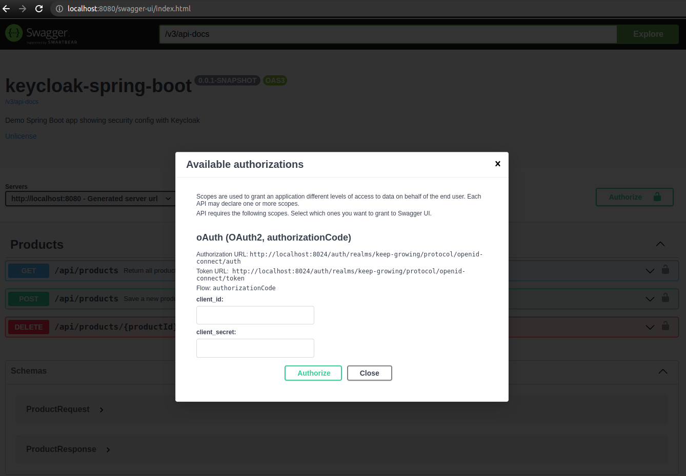
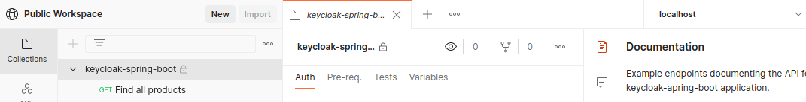

# keycloak-spring-boot

[](https://keepgrowing.in/)

## About this project

This project shows an example integration of Spring Boot with Keycloak.

## Prerequisites

* JDK 17+ ([How to install OpenJDK 17 on Ubuntu](https://keepgrowing.in/java/how-to-install-openjdk-17-on-ubuntu/))
* [Maven](https://maven.apache.org/) (or you can use `mvnw` provided in the project)
* [Docker](https://docs.docker.com/get-docker/)
  (A configuration similar to the one used in this project is described in
  [Keycloak in Docker #1 – How to run Keycloak in a Docker container](https://keepgrowing.in/tools/keycloak-in-docker-1-how-to-run-keycloak-in-a-docker-container/)
  ,
  [Keycloak in Docker #2 – How to import a Keycloak realm](https://keepgrowing.in/tools/keycloak-in-docker-2-how-to-import-a-keycloak-realm/))
  and [Keycloak in Docker #5 – How to export a realm with users and secrets](https://keepgrowing.in/tools/keycloak-in-docker-5-how-to-export-a-realm-with-users-and-secrets/))
  .

## Getting started

First, [clone](https://docs.github.com/en/github/creating-cloning-and-archiving-repositories/cloning-a-repository-from-github/cloning-a-repository)
this repository.

Then, build it locally with:

```shell
mvn clean install
```

You can run the app in a command line with the following command:

```shell
mvn spring-boot:run
```

### Running tests

You can run tests with:

```shell
mvn test
```

### Running Keycloak

Run the `keycloak` service with the following commands:

```shell
cd docker
docker compose up -d
```

### Credentials

Below you'll find a list of default user accounts.

#### Keycloak admin

* username: `keycloak`
* password: `keycloak`

#### Default users

* usernames: `christina`, `hanna`, `carlo`, `noel`
* password: `test`
* realm role: `user`

### Visit Keycloak

* Visit the [http://localhost:8024/auth](http://localhost:8024/auth) url. Select the `Administration Console` option and
  log in as the Keycloak admin [`keycloak:keycloak`].
* As an admin you can see all users associated with the `keep-growing` realm by clicking the `View all users` button on
  the [http://localhost:8024/auth/admin/master/console/#/realms/keep-growing/users](http://localhost:8024/auth/admin/master/console/#/realms/keep-growing/users)
  page.
* What's more, you can log in as any user associated with the `keep-growing` realm by clicking the `Sign in` button on
  the [http://localhost:8024/auth/realms/keep-growing/account](http://localhost:8024/auth/realms/keep-growing/account)
  page.

### API documentation

#### Swagger UI

Swagger UI is available at [http://localhost:8080/swagger-ui.html](http://localhost:8080/swagger-ui.html).
The Keycloak client details are available in the `application.properties` file:
* client_id: `spring-boot-example-app`
* client_secret: `QjLCjk1I9sugcZSDFCsyAkoLOqAHDLKC`



#### OpenAPI

[http://localhost:8080/v3/api-docs](http://localhost:8080/v3/api-docs)

#### Postman

The Postman collection for the API is publicly available[^1], click the button below and select the `localhost`
environment:

[](https://god.gw.postman.com/run-collection/2376101-355eea51-db59-42b1-a7cd-5b30bffbc279?action=collection%2Ffork&collection-url=entityId%3D2376101-355eea51-db59-42b1-a7cd-5b30bffbc279%26entityType%3Dcollection%26workspaceId%3Dcab089bb-1815-498b-a447-bd5ff08145fb#?env%5Blocalhost%5D=W3sia2V5IjoiYmFzZVVybCIsInZhbHVlIjoiaHR0cDovL2xvY2FsaG9zdDo4MDgwIiwiZW5hYmxlZCI6dHJ1ZSwic2Vzc2lvblZhbHVlIjoiaHR0cDovL2xvY2FsaG9zdDo4MDgwIiwic2Vzc2lvbkluZGV4IjowfV0=)



The authorization config used in the collection is described in
the [Kecloak in Docker #7 – How to authorize requests via Postman](https://keepgrowing.in/tools/kecloak-in-docker-7-how-to-authorize-requests-via-postman/)
post

[^1]: Clicking the `Run in Postman` button navigates to the page where you can fork the collection to your workspace.
[Forking the collection](https://learning.postman.com/docs/collaborating-in-postman/version-control-for-collections/#forking-a-collection)
into your workspace will enable you to contribute to the source collection using pull requests. You can also view the
collection in a public workspace if you like and even import a copy of the collection using the links present on the
screen.

## Built With

* [Spring Boot v2.6+](https://spring.io/projects/spring-boot)
* [OpenJDK 17](https://jdk.java.net/17/), [Maven](https://maven.apache.org/)
* [Keycloak](https://www.keycloak.org/), [jboss/keycloak Docker image](https://hub.docker.com/r/jboss/keycloak/),
  [Keycloak Spring Boot adapter](https://www.keycloak.org/docs/latest/securing_apps/#_spring_boot_adapter)
* [springdoc-openapi](https://springdoc.org/)
* [Docker Compose](https://docs.docker.com/compose/)
* [Dummy4j](https://daniel-frak.github.io/dummy4j/)